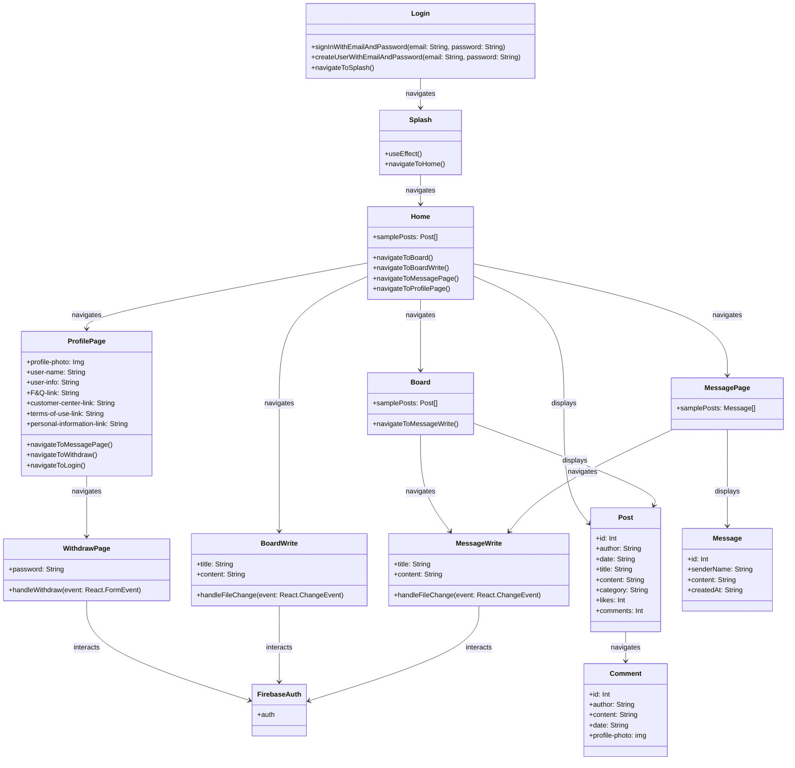

```mermaid
classDiagram
    class Home {
        +samplePosts: Post[]
        +navigateToBoard()
        +navigateToBoardWrite()
        +navigateToMessagePage()
        +navigateToProfilePage()
    }

    class Board {
        +samplePosts: Post[]
        +navigateToMessageWrite()
    }

    class BoardWrite {
        +title: String
        +content: String
        +handleFileChange(event: React.ChangeEvent<HTMLInputElement>)
    }

    class ProfilePage {
        +navigateToMessagePage()
        +profile-photo: Img
        +user-name: String
        +user-info: String
        +F&Q-link: String
        +customer-center-link: String
        +terms-of-use-link: String
        +personal-information-link: String
        +navigateToWithdraw()
        +navigateToLogin()
    }

    class Splash {
        +useEffect()
        +navigateToHome()

    }

    class WithdrawPage {
        +password: String
        +handleWithdraw(event: React.FormEvent)
    }

    class MessagePage {
        +samplePosts: Message[]
    }

    class MessageWrite {
        +title: String
        +content: String
        +handleFileChange(event: React.ChangeEvent<HTMLInputElement>)
    }

    class Post {
        +id: Int
        +author: String
        +date: String
        +title: String
        +content: String
        +category: String
        +likes: Int
        +comments: Int
    }

    class Comment {
        +id: Int
        +author: String
        +content: String
        +date: String
        +profile-photo: img
    }

    class Message {
        +id: Int
        +senderName: String
        +content: String
        +createdAt: String
    }

    class Login {
        +signInWithEmailAndPassword(email: String, password: String)
        +createUserWithEmailAndPassword(email: String, password: String)
        +navigateToSplash()
    }

    class FirebaseAuth {
        +auth
    }

    Login --> Splash : navigates
    Splash --> Home : navigates
    Home --> Board : navigates
    Home --> BoardWrite : navigates
    Home --> MessagePage : navigates
    Home --> ProfilePage : navigates
    Board --> MessageWrite : navigates
    MessagePage --> MessageWrite : navigates
    ProfilePage --> WithdrawPage : navigates
    WithdrawPage --> FirebaseAuth : interacts
    BoardWrite --> FirebaseAuth : interacts
    MessageWrite --> FirebaseAuth : interacts
    Home --> Post : displays
    Board --> Post : displays
    Post --> Comment : navigates
    MessagePage --> Message : displays
```
